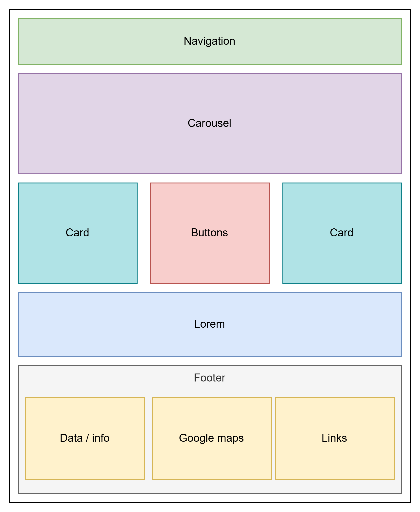

# Workshop #2

## Feladat: Statikus oldalak látványának kiegészítése CSS segítségével

A workshop 01-es feladatban leírt oldalt / oldalakat egészítse ki a megfelelő módon saját CSS, valamint Bootstrap felhasználással.

A fájlok létrehozásakor a következő mappastruktúrát alkalmazza:

    root
    ├── index.html
    ├── styles
    │   ├── main.css
    │   ├── services.css
    │   └── merch.css
    ├── pages
    │   ├── services.html
    │   ├── subjects.html
    │   ├── students.html
    │   ├── merch.html
    │   ├── contact.html
    │   └── problem.html
    └── subjects
        ├── bevezetes-a-programozasba.html
        ├── adatbazis-kezeles-alapjai.html
        ├── operacios-rendszerek.html
        ├── fullstack-fejlesztes.html
        └── mesterseges-intelligencia-alapjai.html

### Saját CSS alkalmazása

A `styles` mappában hozza létre a fentebb látható három állományt. A `main.css` feladata, hogy minden olyan stílusleírást, amely egységesen alkalmazandó a teljes alkalmazáson belül, itt foglaljon helyet. Ezen kívül szükséges még a `services.css` valamint a `merch.css` létrehozása, a megfelelő aloldalakhoz tartozóan.

Minden html fájl a `pages` mappán belül kapja meg a `main.css`-t referenciaként. A másik két aloldal ezen túl még kapja meg a saját CSS-üket is.

Találjon ki valamilyen egységes stílust, amelyet minden oldalon szeretne alkalmazni. Ezt kódolja le a `main.css` fájlba.

A merch (`merch.html`) aloldalon a következőt szeretnénk látni, ezt kódolja le a `merch.css` fájlba:

- a kosárbarakás gombjai legyenek zöldek és bennük a szöveg legyen félkövér
- az input mezők legyenek rövidek, 30-50 pixel szélességűek
- az input mezők térközei legyenek "szellősek"
- az input mezők legyenek lekerekített sarkúak
- a képek legyenek szintén lekerekített sarkúak és mindegyiknek legyen valamilyen színű kerete pár pixel vastagsággal
- egérmutatóval a képekre állva, a kép váltson fekete-fehérre
- egérmutatóval a kosárba gombokra állva, a gomb színe változzon meg

A szolgáltatások (`services.html`) aloldalon lévő táblázatot "szellősre" formázza meg, illetve legyen a táblázatnak magának egy vastag kerete, a benne található celláknak pedig egy vékonyabb kerete. Amikor az egérmutatót a sor fölé viszi, a teljes sor legyen halvány pirossal kiemelve.

### Bootstrap alkalmazása

Azokhoz az aloldalakhoz, ahova nem került be dedikált stílusleíró fájl, oda linkelje be a `main.css` mellett a Bootstrap CSS-ét is. Javasolt az 5.3-as verziót használni. Bootstrap segítségével formázza meg a következőket:

- `subjects.html`
  - a tárgyak táblázata legyen sötét témájú
  - a tárgy neve legyen egy link, amely a neki megfelelő tárgy aloldalára visz át
  - a kreditértéke a tárgynak legyen lekerekített kék badge-be rakva
- `students.html`
  - a hallgatók táblázata legyen világos témájú
  - legyenek a sorok egérmutató ráállás esetén kiemelve
  - ha egy hallgató átlaga 3.5 alatt van, akkor piros badge-be legyen az átlaga, ha e fölött van akkor legyen zöld színűben
  - amennyiben az oldal szélessége 800px alá esik, akkor a táblázat ne jelenjen meg; helyette egy bootstrap piros alert doboz jelenjen meg benne "Mobil nézet nem támogatott" szöveggel
- `contact.html` és `problem.html`
  - az input mezők legyenek bootstrap osztályok segítségével megformázva, tetszőlegesen választható bármelyik fajta
    - [form-control](https://getbootstrap.com/docs/5.3/forms/form-control/)
    - [input-group](https://getbootstrap.com/docs/5.3/forms/input-group/)
    - [floating-labels](https://getbootstrap.com/docs/5.3/forms/floating-labels/)

### Főoldal

#### Navigáció

A navigációs elemeket egészítse ki tetszőlegesen Bootstrap gomb stílussal. Az elemek legyenek középre igazítva. Használható teljes Bootstrap navigációs menüsáv is, de nem kötelező.

#### Tartalom

A főoldal tartalmi részét a következő elvárások, és az alábbi kép mentén alakítsa ki.

- az oldal tetején legyen egy carousel, amelyben képek váltsák egymást
- alatta hozzon létre egy három oszlopból álló grid részt, amelyben:
  - bal oszlop: Bootstrap card valamilyen tetszőleges tartalommal
  - középső oszlop: gombok legyenek egymás alatt amibe programnyelvek legyenek tartalomként beleírva
  - jobb oszlop: Bootstrap card valamilyen tetszőleges tartalommal
- alatta hozzon létre egy nagy egybefüggő részt, amibe csak helykitöltés jelleggel lorem szöveget rakjon bele
- az oldal alján legyen a footer rész, amiben 3 oszlopot alakítson ki
  - bal oszlop: a fiktív magánegyetem adatait adja meg (tel, cím, email stb.)
  - középső oszlop: egy google maps térképet ágyazzon ide be megfelelő méretben
  - jobb oszlop: a navigációban található linkeket itt is sorolja fel egymás alatt

